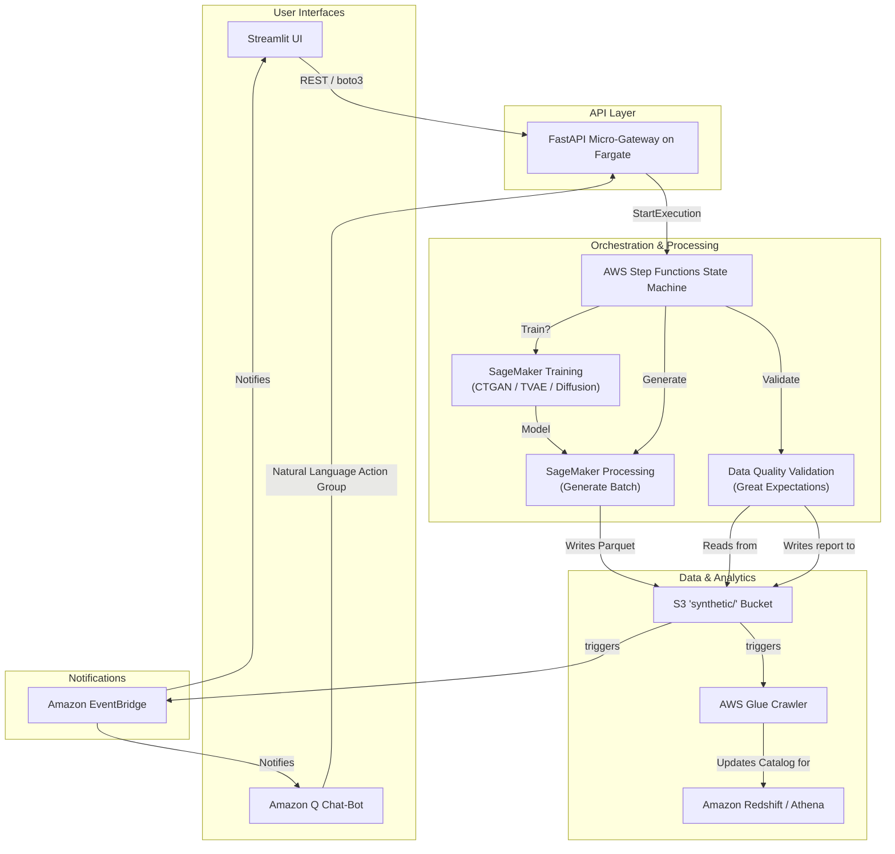

# Synthetic Credit Scoring Data Generator

## 1. Project Overview

This project provides a cloud-native solution for generating synthetic credit scoring data. It leverages a pre-trained Conditional Tabular Generative Adversarial Network (CTGAN) model to create realistic, privacy-preserving datasets that can be used for model training, testing, and financial analysis.

The entire workflow is orchestrated on Amazon Web Services (AWS) and defined using the AWS Cloud Development Kit (CDK), enabling robust, repeatable, and scalable infrastructure deployment.

## 2. Features and Functionality (Current & Planned)

*   **Multi-Interface Support:** Users can interact with the system through an intuitive **Streamlit web application** or a conversational **Amazon Q Chat-Bot**, which uses natural language to trigger data generation jobs.
*   **Robust API Gateway:** A central **FastAPI micro-gateway**, deployed on AWS Fargate, securely manages and routes incoming requests from all user interfaces to the backend services.
*   **Intelligent Workflow Orchestration:** An **AWS Step Functions state machine** orchestrates the entire end-to-end process, from model training to data validation and notification.
*   **On-Demand Model Training:** The system can automatically **train new generative models** (e.g., CTGAN, TVAE, or Diffusion models) using SageMaker if a suitable model doesn't already exist for a given task.
*   **Scalable Data Generation:** The platform uses **SageMaker Processing jobs** running in custom Docker containers to generate large batches of synthetic data on demand.
*   **Automated Data Quality Assurance:** After generation, data passes through an automated quality control step using frameworks like **Great Expectations** or **YData-Profiling** to ensure its integrity and statistical validity.
*   **Data Lake & Analytics Integration:** The validated synthetic data is stored in an S3 bucket, automatically cataloged by an **AWS Glue crawler**, and made available for large-scale analysis in **Amazon Redshift** or **Amazon Athena**.
*   **Event-Driven Notifications:** **Amazon EventBridge** monitors the workflow and sends real-time notifications back to the user interface (e.g., Streamlit or Amazon Q) upon completion of a data generation task.

## 3. Project Architecture

The following diagram illustrates the complete, planned architecture of the system:



## 4. How to Test the Application (Demo Mode)

These instructions will guide you through running the application in its local demonstration mode. This mode simulates the data generation process using a local file and **does not require AWS credentials or infrastructure deployment.**

### Prerequisites

*   Python 3.9 or higher
*   Pip package installer

### Setup and Running the Demo

1.  **Navigate to the Project Root:**
    Open your terminal and make sure you are in the root directory of this project (`Credit-scoring-data-synthetic-generator/`).

2.  **Set up a Virtual Environment (Recommended):**
    ```bash
    python3 -m venv venv
    source venv/bin/activate
    # On Windows, use: venv\Scripts\activate
    ```

3.  **Install Dependencies:**
    Install all required Python packages using the `requirements.txt` file in the project root.
    ```bash
    pip install -r requirements.txt
    ```

4.  **Generate the Mock Data File:**
    The application's demo mode relies on a local data file. Run the following command from the project root directory to generate it. This script uses the pre-trained model to create a 1,000-row dataset.
    ```bash
    python3 sagemaker/processing/generate.py
    ```
    This will create a new file located at `output/mock-data.parquet`.

5.  **Run the Web Application:**
    Launch the Streamlit UI with the following command:
    ```bash
    streamlit run ui/app.py
    ```

6.  **Test in Your Browser:**
    Open the "Local URL" provided by Streamlit (e.g., `http://localhost:8502`) in your web browser. You can now use the interface to input a desired number of rows and generate synthetic data instantly.
